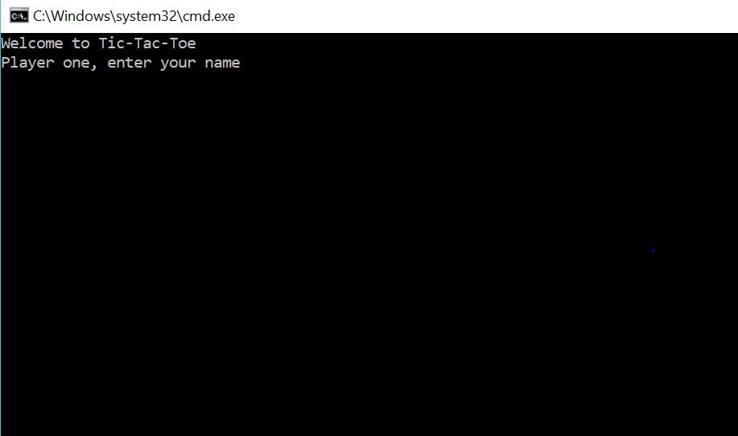
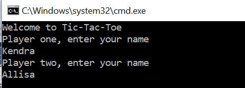
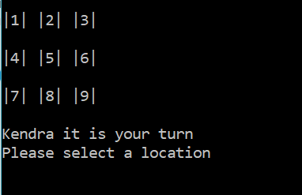
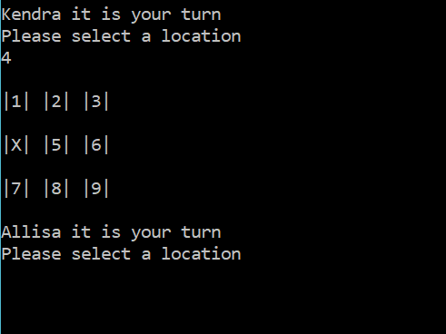
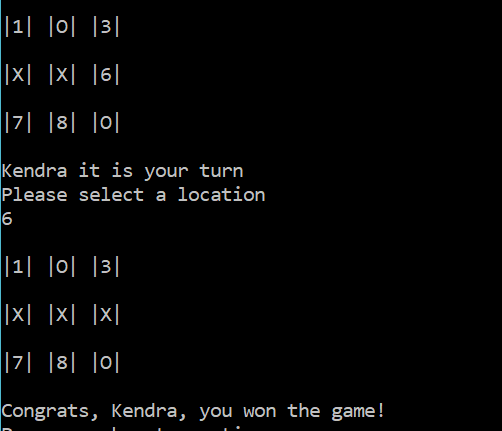

# lab04-TicTacToe
C# console app 2-player tic-tac-toe game

# Directions
To play the game, you will need to clone the repository to your local machine and open the project solution in VS. Run the program without debugging. Follow the prompts to enter two user names. The game will begin with player one (assigned X) choosing a number on the game board. Next, player two (assigned O) will choose an available number on the board. Continue until there is a winner or until there is a draw.

# Creators:
Kendra Ellis and Allisa LeBeuf

# Visuals

